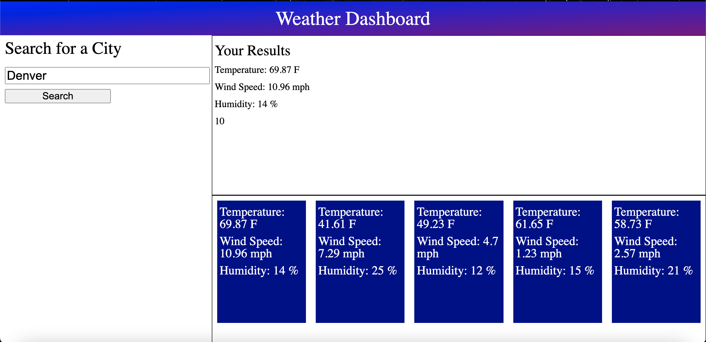

# Weather Dashboard

## Weather Dashboard Description

This application is designed to help people view the weather in different cities. This application was a tad rushed, so there are a few bugs. For example, the data doesn't quite store right to local storage, but on the bright side, the data is visual. Future updates will focus on completing the local storage saving.

## Using application

To use this application, visit the deployed application: https://jacksonwhite4725.github.io/weather-dashboard/